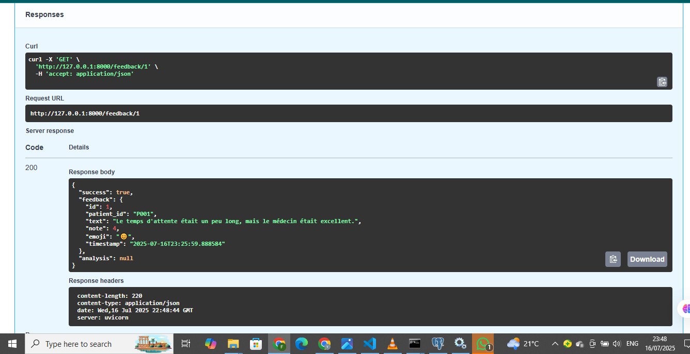

# 🧠 Backend - Track 1: Patient Feedback & Reminder System

Ce backend FastAPI est le cœur du projet Track 1 du hackathon CODE2CARE, développé par l'équipe **Lumina**. Il est conçu pour une gestion efficace des retours patients et, à terme, des rappels multilingues.

## ✨ Fonctionnalités

Ce service permet de :
* **Collecter les retours patients** : Saisie de feedbacks sous forme de texte, de notes numériques et d'emojis.
* **Stocker les données** : Centralisation sécurisée des feedbacks dans une base de données MongoDB.
* **Récupérer les informations** : Accès simplifié aux feedbacks via une API robuste.
* **(À venir) Gérer les rappels multilingues** : Fonctionnalités futures pour l'envoi de rappels par SMS et e-mail.

## 🚀 Stack Technique

Le projet s'appuie sur les technologies suivantes :
* **FastAPI** : Un framework Python moderne, rapide et performant pour la construction d'APIs.
* **MongoDB** : Une base de données NoSQL flexible, idéale pour stocker des données non structurées comme les feedbacks.
* **Uvicorn** : Un serveur ASGI ultra-rapide, essentiel pour exécuter les applications FastAPI.
* **Python-dotenv** : Pour une gestion sécurisée et efficace des variables d'environnement (ex: clés API, identifiants de connexion).

## 📁 Structure du Projet

# 🧠 Backend - Track 1: Patient Feedback & Reminder System

Ce backend FastAPI est le cœur du projet Track 1 du hackathon CODE2CARE, développé par l'équipe **Lumina**. Il est conçu pour une gestion efficace des retours patients et, à terme, des rappels multilingues.## ✨ Fonctionnalités

Ce service permet de :* **Collecter les retours patients** : Saisie de feedbacks sous forme de texte, de notes numériques et d'emojis.* **Stocker les données** : Centralisation sécurisée des feedbacks dans une base de données MongoDB.* **Récupérer les informations** : Accès simplifié aux feedbacks via une API robuste.* **(À venir) Gérer les rappels multilingues** : Fonctionnalités futures pour l'envoi de rappels par SMS et e-mail.## 🚀 Stack Technique

Le projet s'appuie sur les technologies suivantes :* **FastAPI** : Un framework Python moderne, rapide et performant pour la construction d'APIs.* **MongoDB** : Une base de données NoSQL flexible, idéale pour stocker des données non structurées comme les feedbacks.* **Uvicorn** : Un serveur ASGI ultra-rapide, essentiel pour exécuter les applications FastAPI.* **Python-dotenv** : Pour une gestion sécurisée et efficace des variables d'environnement (ex: clés API, identifiants de connexion).## 📁 Structure du Projet
backend/
│
├── main.py               # Point d'entrée principal de l'application FastAPI
├── requirements.txt      # Liste des dépendances Python requises
├── .env                  # Fichier de configuration pour les variables d'environnement (ex: connexion MongoDB)
├── app/
│   ├── routes.py         # Définition des routes API (gestion des feedbacks)
│   ├── database.py       # Module de connexion et d'interaction avec MongoDB
│   └── models.py         # (À venir) Modèles Pydantic pour la validation des données


---

## ⚙️ Installation et Lancement

Pour configurer et démarrer le serveur backend, suivez ces étapes :

```bash
# 1. Cloner le dépôt et naviguer vers le dossier backend
git clone <URL_DE_VOTRE_DEPOT>
cd Track1_Patient-Feedback-Reminder/backend

# 2. Installer les dépendances Python
pip install -r requirements.txt
```


##   Configurer la base de donnéesCréer un fichier .env avec le contenu suivant :

DB_HOST=localhost
DB_PORT=5432
DB_NAME=patient_feedback_db
DB_USER=postgres
DB_PASSWORD=****

## 3. Lancer le serveur FastAPI
uvicorn main:app --reload


## Acceder au docs


## Endpoints API POST /feedbackCréer un nouveau feedback patient.Requête JSON :

### POST /feedback : Crée un nouveau feedback patient.Requête JSON :


### GET /feedbacks : Liste tous les feedbacks.Réponse :


### GET /feedback/{id} : Récupére un feedback spécifique et son analyse IA (si disponible).Réponse




###  POST /feedback/{id}/analyze  : Associe une analyse IA à un feedback existant.


#### GET /insights  : Liste toutes les analyses IA.


 

#### GET /recommendations : Extraire toutes les recommandations (actionable_insights) des analyses IA.


#### Auteurs
Projet développé par l'équipe Lumina – CODE2CARE Hackathon


