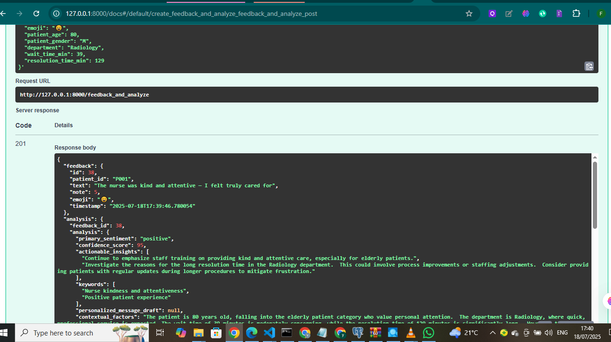
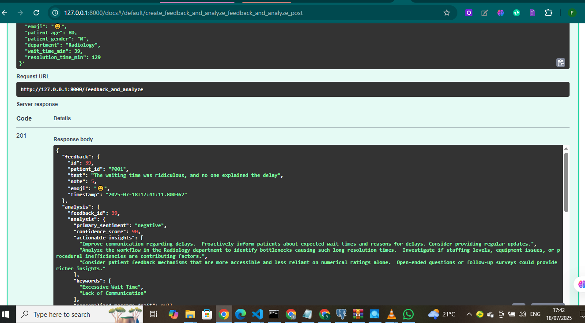

# 🧠 Backend - Track 1: Patient Feedback & Reminder System

Ce backend FastAPI est le cœur du projet Track 1 du hackathon CODE2CARE, développé par l'équipe **Lumina**. Il est conçu pour une gestion efficace des retours patients et, à terme, des rappels multilingues.

---

## ✨ Fonctionnalités

Ce service permet de :
* **Collecter les retours patients** : Saisie de feedbacks sous forme de texte, de notes numériques et d'emojis.
* **Stocker les données** : Centralisation sécurisée des feedbacks dans une base de données.
* **Récupérer les informations** : Accès simplifié aux feedbacks via une API robuste.
* **(À venir) Gérer les rappels multilingues** : Fonctionnalités futures pour l'envoi de rappels par SMS et e-mail.

---

## 🚀 Stack Technique

Le projet s'appuie sur les technologies suivantes :
* **FastAPI** : Un framework Python moderne, rapide et performant pour la construction d'APIs.
* **PostgreSQL** : Une base de données relationnelle robuste et open-source, idéale pour stocker des données structurées comme les feedbacks.
* **Uvicorn** : Un serveur ASGI ultra-rapide, essentiel pour exécuter les applications FastAPI.
* **Python-dotenv** : Pour une gestion sécurisée et efficace des variables d'environnement (ex: clés API, identifiants de connexion).

---


## ⚙️ Installation et Lancement

Pour configurer et démarrer le serveur backend, suivez ces étapes :

```bash
# 1. Cloner le dépôt et naviguer vers le dossier backend
git clone <URL_DE_VOTRE_DEPOT>
cd Track1_Patient-Feedback-Reminder/backend

# 2. Installer les dépendances Python
pip install -r requirements.txt
```


##   Configurer la base de donnéesCréer un fichier .env avec le contenu suivant :

DB_HOST=localhost
DB_PORT=5432
DB_NAME=patient_feedback_db
DB_USER=postgres
DB_PASSWORD=****

## 3. Lancer le serveur FastAPI
uvicorn main:app --reload


## Acceder au docs

## Sommaire

- [Feedback et Analyse IA](#feedback-et-analyse-ia)
  - [POST /feedback_and_analyze](#post-feedback_and_analyze)
  - [GET /feedbacks](#get-feedbacks)
  - [GET /feedback/{id}](#get-feedbackid)
  - [POST /feedback/{id}/analyze](#post-feedbackidanalyze)
  - [GET /insights](#get-insights)
  - [GET /recommendations](#get-recommendations)
- [Demandes de Rappel/Rendez-vous](#demandes-de-rappelrendez-vous)
  - [POST /recall-requests](#post-recall-requests)
  - [GET /recall-requests](#get-recall-requests)
  - [GET /recall-requests/{request_id}](#get-recall-requestsrequest_id)
  - [PUT /recall-requests/{request_id}/status](#put-recall-requestsrequest_idstatus)
- [Messages Personnalisés](#messages-personnalisés)
  - [POST /personalized-messages](#post-personalized-messages)
  - [GET /personalized-messages](#get-personalized-messages)


# Documentation de l'API

 Description  des différentes routes disponibles dans l'API, leurs fonctionnalités, les formats de requête et de réponse attendus.

---

## Endpoints API POST /feedback Créer un nouveau feedback patient.Requête JSON :

### POST /feedback
This endpoint allows you to record a new patient feedback entry directly into the database.

Request Body (application/json):

The request body should be a JSON object containing the feedback details:

**Requête JSON :**
```json

{
  "patient_id": "string",          
  "text": "string",                
  "note": float,                  
  "emoji": "string",              
  "patient_age": float,            
  "patient_gender": "string",     
  "department": "string",          
  "wait_time_min": float,         
  "resolution_time_min": float
}
```

-----

## Feedback et Analyse IA

### `POST /feedback_and_analyze`
Crée un nouveau feedback patient et déclenche son analyse IA.

**Requête JSON :**
```json
{
  "patient_id": "string",
  "text": "string",
  "note": float,
  "emoji": "string",
  "patient_age": float,
  "patient_gender": "string",
  "department": "string",
  "wait_time_min": float,
  "resolution_time_min": float
}
````

**Exemple de réponse :**

```json
{
  "id": 1,
  "patient_id": "patient123",
  "text": "Le service était excellent.",
  "note": 4.5,
  "emoji": "😊",
  "patient_age": 30,
  "patient_gender": "Femme",
  "department": "Cardiologie",
  "wait_time_min": 15,
  "resolution_time_min": 30,
  "analysis_id": 101,
  "created_at": "2025-07-18T10:00:00Z"
}
```

# Résultats d'analyse de sentiment

## Sentiment Négatif


## Sentiment Positif

-----

### `GET /feedbacks`

Liste tous les feedbacks.

**Réponse :**

```json
[
  {
    "id": 1,
    "patient_id": "patient123",
    "text": "Le service était excellent.",
    "note": 4.5,
    "emoji": "😊",
    "patient_age": 30,
    "patient_gender": "Femme",
    "department": "Cardiologie",
    "wait_time_min": 15,
    "resolution_time_min": 30,
    "analysis_id": 101,
    "created_at": "2025-07-18T10:00:00Z"
  },
  {
    "id": 2,
    "patient_id": "patient124",
    "text": "Temps d'attente trop long.",
    "note": 2.0,
    "emoji": "😞",
    "patient_age": 55,
    "patient_gender": "Homme",
    "department": "Urgence",
    "wait_time_min": 60,
    "resolution_time_min": 45,
    "analysis_id": null,
    "created_at": "2025-07-18T10:15:00Z"
  }
]
```

-----

### `GET /feedback/{id}`

Récupère un feedback spécifique et son analyse IA (si disponible).

**Paramètres :**

  * `id`: Identifiant unique du feedback (entier)

**Réponse :**

```json
{
  "id": 1,
  "patient_id": "patient123",
  "text": "Le service était excellent.",
  "note": 4.5,
  "emoji": "😊",
  "patient_age": 30,
  "patient_gender": "Femme",
  "department": "Cardiologie",
  "wait_time_min": 15,
  "resolution_time_min": 30,
  "analysis": {
    "id": 101,
    "feedback_id": 1,
    "sentiment": "positif",
    "keywords": ["service", "excellent"],
    "actionable_insights": ["Maintenir la qualité du service client."],
    "created_at": "2025-07-18T10:05:00Z"
  },
  "created_at": "2025-07-18T10:00:00Z"
}
```

-----

### `POST /feedback/{id}/analyze`

Associe une analyse IA à un feedback existant.

**Paramètres :**

  * `id`: Identifiant unique du feedback (entier)

**Requête JSON (exemple d'une analyse IA à associer) :**

```json
{
  "sentiment": "positif",
  "keywords": ["service", "excellent"],
  "actionable_insights": ["Maintenir la qualité du service client."]
}
```

**Exemple de réponse :**

```json
{
  "id": 1,
  "patient_id": "patient123",
  "text": "Le service était excellent.",
  "note": 4.5,
  "emoji": "😊",
  "patient_age": 30,
  "patient_gender": "Femme",
  "department": "Cardiologie",
  "wait_time_min": 15,
  "resolution_time_min": 30,
  "analysis_id": 101,
  "created_at": "2025-07-18T10:00:00Z",
  "message": "Analyse IA associée avec succès."
}
```

-----

### `GET /insights`

Liste toutes les analyses IA.

**Réponse :**

```json
[
  {
    "id": 101,
    "feedback_id": 1,
    "sentiment": "positif",
    "keywords": ["service", "excellent"],
    "actionable_insights": ["Maintenir la qualité du service client."],
    "created_at": "2025-07-18T10:05:00Z"
  },
  {
    "id": 102,
    "feedback_id": 2,
    "sentiment": "négatif",
    "keywords": ["attente", "long"],
    "actionable_insights": ["Réduire le temps d'attente aux urgences."],
    "created_at": "2025-07-18T10:20:00Z"
  }
]
```

-----

### `GET /recommendations`

Extrait toutes les recommandations (`actionable_insights`) des analyses IA.

**Réponse :**

```json
[
  "Maintenir la qualité du service client.",
  "Réduire le temps d'attente aux urgences."
]
```

-----

## Demandes de Rappel/Rendez-vous

### `POST /recall-requests`

Crée une nouvelle demande de rappel/rendez-vous.

**Requête JSON :**

```json
{
  "patient_id": "string",
  "request_object": "string",
  "requested_date": "string" // Format ISO 8601 (ex: "2025-07-18T09:40:00Z")
}
```

**Exemple de réponse :**

```json
{
  "id": 201,
  "patient_id": "patient125",
  "request_object": "Rendez-vous avec le Dr. Dupont",
  "requested_date": "2025-07-25T14:00:00Z",
  "status": "pending",
  "created_at": "2025-07-18T09:45:00Z"
}
```

-----

### `GET /recall-requests`

Liste toutes les demandes de rappel/rendez-vous.

**Paramètres (optionnels) :**

  * `status_filter`: Filtre par statut (`"pending"`, `"approved"`, `"rejected"`, `"completed"`)

**Réponse :**

```json
[
  {
    "id": 201,
    "patient_id": "patient125",
    "request_object": "Rendez-vous avec le Dr. Dupont",
    "requested_date": "2025-07-25T14:00:00Z",
    "status": "pending",
    "created_at": "2025-07-18T09:45:00Z"
  },
  {
    "id": 202,
    "patient_id": "patient126",
    "request_object": "Rappel pour résultats d'analyses",
    "requested_date": "2025-07-20T10:00:00Z",
    "status": "approved",
    "created_at": "2025-07-18T09:50:00Z"
  }
]
```

-----

### `GET /recall-requests/{request_id}`

Récupère une demande de rappel/rendez-vous spécifique.

**Paramètres :**

  * `request_id`: Identifiant unique de la demande de rappel (entier)

**Réponse :**

```json
{
  "id": 201,
  "patient_id": "patient125",
  "request_object": "Rendez-vous avec le Dr. Dupont",
  "requested_date": "2025-07-25T14:00:00Z",
  "status": "pending",
  "created_at": "2025-07-18T09:45:00Z"
}
```

-----

### `PUT /recall-requests/{request_id}/status`

Met à jour le statut d'une demande de rappel/rendez-vous.

**Paramètres :**

  * `request_id`: Identifiant unique de la demande de rappel (entier)

**Requête JSON :**

```json
{
  "new_status": "string", // ("pending", "approved", "rejected", "completed")
  "approved_by": "string"
}
```

**Exemple de réponse :**

```json
{
  "id": 201,
  "patient_id": "patient125",
  "request_object": "Rendez-vous avec le Dr. Dupont",
  "requested_date": "2025-07-25T14:00:00Z",
  "status": "approved",
  "approved_by": "Dr. Jean",
  "created_at": "2025-07-18T09:45:00Z",
  "updated_at": "2025-07-18T10:30:00Z"
}
```

-----

## Messages Personnalisés

### `POST /personalized-messages`

Enregistre un nouveau message personnalisé envoyé à un patient.

**Requête JSON :**

```json
{
  "recall_request_id": integer,
  "patient_id": "string",
  "message_content": "string",
  "sent_by": "string",
  "ai_message_analysis": {} // Analyse IA optionnelle au format JSON
}
```

**Exemple de réponse :**

```json
{
  "id": 301,
  "recall_request_id": 201,
  "patient_id": "patient125",
  "message_content": "Votre rendez-vous avec le Dr. Dupont est confirmé pour le 25 juillet à 14h.",
  "sent_by": "Assistant IA",
  "ai_message_analysis": {
    "sentiment": "positif",
    "keywords": ["rendez-vous", "confirmé"]
  },
  "sent_at": "2025-07-18T10:45:00Z"
}
```

-----

### `GET /personalized-messages`

Liste tous les messages personnalisés envoyés.

**Réponse :**

```json
[
  {
    "id": 301,
    "recall_request_id": 201,
    "patient_id": "patient125",
    "message_content": "Votre rendez-vous avec le Dr. Dupont est confirmé pour le 25 juillet à 14h.",
    "sent_by": "Assistant IA",
    "ai_message_analysis": {
      "sentiment": "positif",
      "keywords": ["rendez-vous", "confirmé"]
    },
    "sent_at": "2025-07-18T10:45:00Z"
  },
  {
    "id": 302,
    "recall_request_id": null,
    "patient_id": "patient127",
    "message_content": "Nous avons bien reçu votre feedback et vous remercions.",
    "sent_by": "Service Client",
    "ai_message_analysis": null,
    "sent_at": "2025-07-18T11:00:00Z"
  }
]
```


#### Auteurs
Projet développé par l'équipe Lumina – CODE2CARE Hackathon
